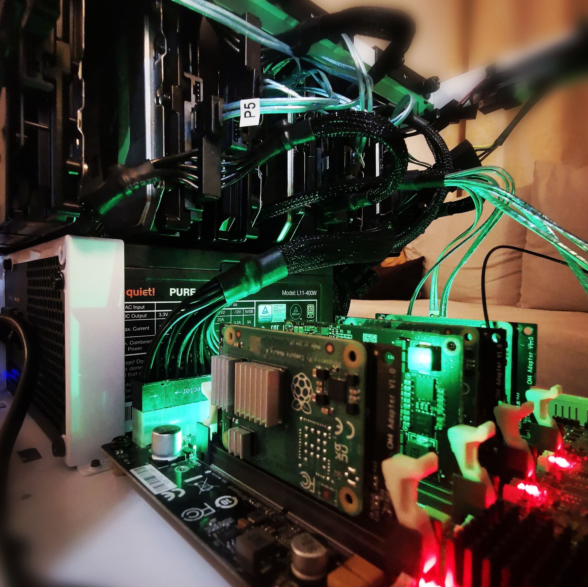

# Personal homelab K3s cluster project

This project automatically builds a [K3s](https://k3s.io/) cluster on a [Turing Pi 2](https://turingpi.com/product/turing-pi-2/) using [Ansible](https://www.ansible.com/).

Currently a work in progress, so don't expect this to run out of the box. Since this is a personal project, it's heavily configured towards my own hardware and I don't have any plans to change this for the foreseeable future. I'm using this to learn about self-hosting, IaaC, system integration, etc. -- be careful about taking inspiration from anything you see here.

## Features

### Summary
- Infrastructure as a Code (IaaC)
	- Ansible automation wherever possible
- Self-hosted services
	- Nextcloud, Home Assistant, Jellyfin, PiHole
- Automated Backups
	- Data safety: distributed storage, ZFS pools on multiple nodes with scheduled scrubs

#### Automated with Ansible
- [x] [Hardware provisioning](https://github.com/notthebee/infra)
- [x] [SSH hardening](https://github.com/geerlingguy/ansible-role-security)
- [ ] [ZFS installation](https://github.com/mrlesmithjr/ansible-zfs) and pool creation
- Broken by upgrade to Turing RK1s 
- [x] [K3s installation](https://github.com/PyratLabs/ansible-role-k3s)

#### Kubernetes Deployments
- [x] Home Assistant
- [x] Mosquitto
- [x] Zigbee2MQTT
- [x] Node-RED
- [ ] Nextcloud
- [ ] Collabora

#### Roadmap
- [ ] VPN with WireGuard and Mullvad
- [ ] Certificate management
- [ ] Cloudflare tunneling

## Hardware list

- Turing Pi 2
	- node-1: Turing RK1 32 GB
	- node-2: Turing RK1 32 GB
	- node-3: Nvidia Jetson TX2 NX
	- node-4: Raspberry Pi CM4 (Lite, 8 GB RAM)
- External node(s)
	- node-5: ZimaBoard 832

- Storage
	- HDD: 
		- 6 x 4 TB Seagate Ironwolf NAS
	- SSD: 
		- 4 x 500 GB NVMe (Crucial P3, Kingston NV2)
		- 1 x 960 GB 2.5" SATA (Kingston SA400S37)
	- MicroSD:
		- 3 x SanDisk 64 GB Extreme PRO
- Power supply:
	- be quiet! Pure Power 11 400W
- Case
	- Fractal Design Node 304 - White
- Peripherals
	- SONOFF Zigbee 3.0 USB Dongle Plus
	- 2 x mPCIe 4 Port SATA Controller (Kalea Informatique)